# **TrackYourGoals**

# TYG 
## Is a real world solution for everyone who wants to keep track and fulfill personal economic development. 

## **Drive Towards Your Financial Goals.** 

### <p> The world is financially real. Our financial health is a key detonator for life wellness. We think planning and discipline can help us move forward towards our goals and that technology can help us make it happen.
### <p>**TYG** aids us with keeping track of our savings. Its bold and secure interface intuitively helps us create user profiles and as many financial goals as needed, and most important keep track, wherever you are. 
## Build Status
## Table of Contents : 
1. [Project Description](#tyg) 
2. [Installation](#installation)
3. [Usage](#usage)
4. [Build](#build)
5. [Api Reference](#api)
6. [Team Challenges](#challenges)
7. [Features](#features)
8. [Code Examples](#code)
9. [Credits](#credits)
10. [Licence](#licence)
## Installation:
Github  
```md 
https://github.com/1alyciaoliveira/TrackYourGoals.git
```

Heroku  
``` md 
https://track-your-goals-180d59665ffa.herokuapp.com/login
```  
Local  
``` md 
git clone https://github.com/1alyciaoliveira/TrackYourGoals.git
```

## Usage: (sreenshots)
#### Signing Up
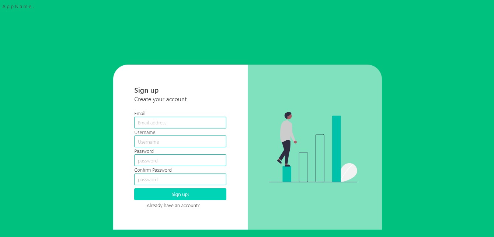
- Add up email, username.
- Create password at least 8 characters long maximum 128.
- Recieve almost instantly email confirmation and a secure key. 
- Authorize profile creation by adding confirmation key on prompt.
- Go back to log interface after acount creation.

#### Log In
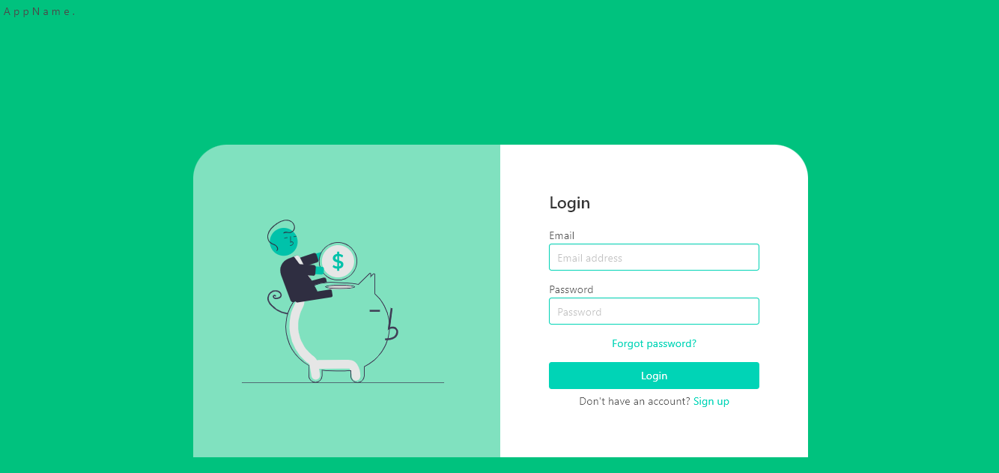
Prompted to add your User Name and Secret Password. 

#### ADD a New Goal
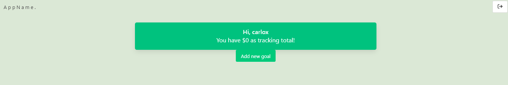  

Navigate towards creation of your new financial objective.    
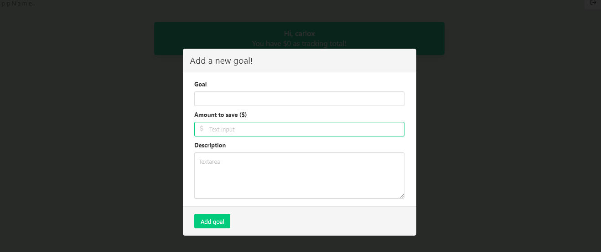
- Add a goal title.  
- Add a saving amount. 
- Add a thorough goal description. 

### Goal Dashboard Viewer

- Goal Transaction Menu  
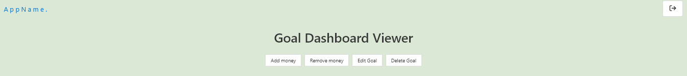\
    Add Money  
  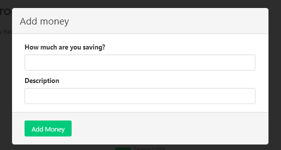\
    Remove Money  
    - Withdrawal button, keep track of those financial moments where we have to change strategy and spend some of our savings for a good reason. Keep track of those expenditures. 

  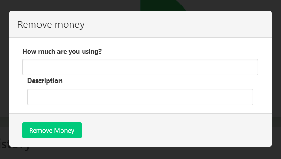\
    Goal Editing  
    - Clic on goal title to modify.  
  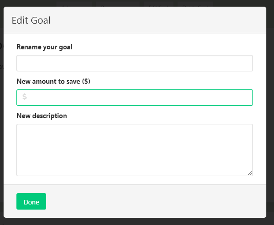\
    Delete Goal\
  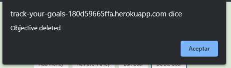\
- Track Your Progress\
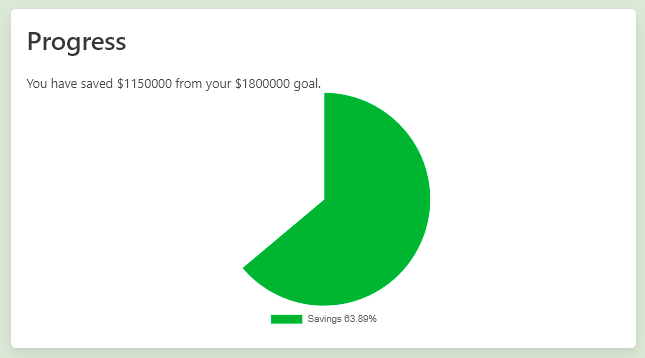\
- Track Your Transaction History \
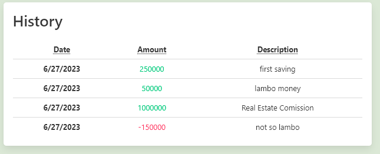\
- View Your Transaction Statistics \
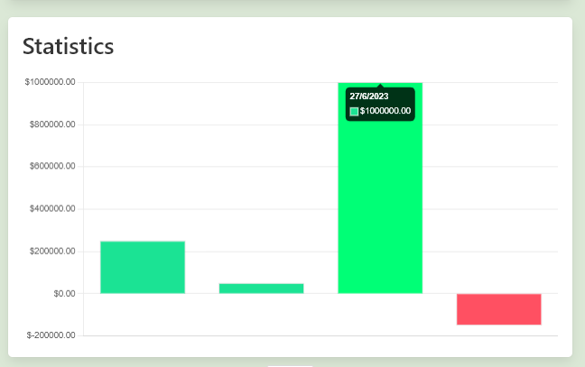\

## Future Development
 - Let make real bank transactions through app.
 - Erase Account. 
 - Goal Fulfillment Congratulation Animation. 
 - Link to goal wish page. 

## Build:
- Undraw.co (SVG)
- NPM modules
  - Nodemailer 
  - Sequelize
 - Bulma (CSS Styles)
 - Handlebars (Template Engine)
 - MySQL (Database)
 - Javascript 
 - HTML

 
## MVC
## **Models**
index.js  
```js
const User = require('./User');
const Transaction = require('./Transaction');
const Objective = require('./Objective');
const Verification = require('./Verification');
const Recovery = require('./Recovery');


User.hasMany(Objective, {
    foreignKey: 'user_id',
    onDelete: 'CASCADE'
});

Objective.belongsTo(User, {
    foreignKey: 'user_id'
});

User.hasMany(Transaction, {
    foreignKey: 'user_id',
    onDelete: 'CASCADE'
});

Objective.hasMany(Transaction, {
    foreignKey: 'objective_id',
    onDelete: 'CASCADE'
});

Transaction.belongsTo(Objective, {
    foreignKey:'objective_id'
});

module.exports = { User, Transaction, Objective, Verification , Recovery};
```
- Objective.js
``` js 
const { Model, DataTypes } = require('sequelize');
const sequelize = require('../config/connection');

class Objective extends Model { }

Objective.init(
    {
        id: {
            type: DataTypes.INTEGER,
            allowNull: false,
            primaryKey: true,
            autoIncrement: true,
        },
        user_id: {
            type: DataTypes.INTEGER,
            references: {
                model: 'user',
                key: 'id',
            },
        },
        name: {
            type: DataTypes.STRING,
            allowNull: false,
        },
        target_quantity: {
            type: DataTypes.INTEGER,
            allowNull:false
        },
        image_path: {
            type: DataTypes.STRING,
            allowNull:true
        },
        description: {
            type: DataTypes.STRING,
        },
        date_created: {
            type: DataTypes.DATE,
            allowNull: false,
            defaultValue: DataTypes.NOW,
        }        
    },
    {
        sequelize,
        timestamps: false,
        freezeTableName: true,
        underscored: true,
        modelName: 'objective',
    }
);

module.exports = Objective;

```
- Recovery.js 
Github  
```js
const { Model, DataTypes } = require('sequelize');
const sequelize = require('../config/connection');

class Recovery extends Model {}

Recovery.init(
    {
        id: {
            type: DataTypes.INTEGER,
            allowNull: false,
            primaryKey: true,
            autoIncrement: true,
        },
        email: {
            type: DataTypes.STRING,
            allowNull: false,
            unique: true,
            validate: {
                isEmail: true,
            },
        },
        code: {
            type: DataTypes.INTEGER,
            allowNull: false,
        }
    },
    {       
        sequelize,
        timestamps: false,
        freezeTableName: true,
        underscored: true,
        modelName: 'recovery',
    }
);

module.exports = Recovery;

```

- Transaction.js
```js
const { Model, DataTypes } = require('sequelize');
const sequelize = require('../config/connection');

class Transaction extends Model { }

Transaction.init(
    {
        id: {
            type: DataTypes.INTEGER,
            allowNull: false,
            primaryKey: true,
            autoIncrement: true,
        },
        user_id: {
            type: DataTypes.INTEGER,
            references: {
                model: 'user',
                key: 'id',
            },
        },
        objective_id: {
            type: DataTypes.INTEGER,
            references: {
                model: 'objective',
                key: 'id',
            },
        },
        quantity: {
            type: DataTypes.INTEGER,
            allowNull:true // changed to true so it can accept negative values
        },
        description: {
            type: DataTypes.STRING,
        },
        date_created: {
            type: DataTypes.DATE,
            allowNull: false,
            defaultValue: DataTypes.NOW,
        }     
    },
    {
        sequelize,
        timestamps: false,
        freezeTableName: true,
        underscored: true,
        modelName: 'transaction',
    }
)

module.exports = Transaction;

```
- User.js 
``` js
const { Model, DataTypes } = require('sequelize');
const bcrypt = require('bcrypt');
const sequelize = require('../config/connection');

class User extends Model {
    checkPassword(loginPw) {
        return bcrypt.compareSync(loginPw, this.password);
    }
}
User.init(
    {
        id: {
            type: DataTypes.INTEGER,
            allowNull: false,
            primaryKey: true,
            autoIncrement: true,
        },
        name: {
            type: DataTypes.STRING,
            allowNull: false,
        },
        email: {
            type: DataTypes.STRING,
            allowNull: false,
            unique: true,
            validate: {
                isEmail: true,
            },
        },
        password: {
            type: DataTypes.STRING,
            allowNull: false,
            validate: {
                len: [8],
            },
        },
        isVerified: {
            type: DataTypes.BOOLEAN,
            allowNull: false,
            defaultValue: false,
        },
    },
    {
        hooks: {
            beforeCreate: async (newUserData) => {
                newUserData.password = await bcrypt.hash(newUserData.password, 10);
                return newUserData;
            },
            beforeUpdate: async (updatedUserData) => {
                updatedUserData.password = await bcrypt.hash(updatedUserData.password, 10);
                return updatedUserData;
            },
        },
        sequelize,
        timestamps: false,
        freezeTableName: true,
        underscored: true,
        modelName: 'user',
    }
);

module.exports = User;

```

- Verification.js
``` js
const { Model, DataTypes } = require('sequelize');
const sequelize = require('../config/connection');

class Verification extends Model {}

Verification.init(
    {
        id: {
            type: DataTypes.INTEGER,
            allowNull: false,
            primaryKey: true,
            autoIncrement: true,
        },
        email: {
            type: DataTypes.STRING,
            allowNull: false,
            unique: true,
            validate: {
                isEmail: true,
            },
        },
        code: {
            type: DataTypes.INTEGER,
            allowNull: false,
        }
    },
    {       
        sequelize,
        timestamps: false,
        freezeTableName: true,
        underscored: true,
        modelName: 'verification',
    }
);

module.exports = Verification;

```
## **View**
### Layouts
- main.handlebars 
``` html 
<!DOCTYPE html>
<html lang="en">

<head>
  <meta charset="UTF-8">
  <meta name="viewport" content="width=device-width, initial-scale=1.0">
  <title>A p p N a m e .</title>
  <link rel="stylesheet" href="https://cdn.jsdelivr.net/npm/bulma@0.9.1/css/bulma.min.css">
</head>

<body>
    <header>

    <nav class="navbar is-flex" style="background-color: rgba(255, 255, 255, 0);">
      <div class="navbar-brand">
        <a class="navbar-item" href="/profile">
          A p p N a m e . 
        </a>
      </div>

      <div class="navbar-end">
        <div class="navbar-item">
          <div class="buttons">
            {{#if logged_in}}
            {{!-- <a href="/profile">profile</a> 
            {{else}}
            --}}
              <button class="button" id="logout"><i class="fa-solid fa-arrow-right-from-bracket"></i></button>
            {{/if}}
          </div>
        </div>
      </div>
    </nav>

    </header>
    <main class="container container-fluid mt-5">
      <!-- Render the sub layout -->
      {{{ body }}}
    </main>
    <footer>
      
    </footer>
  </div>

  <!-- Render script for logged in users only -->
  {{#if logged_in}}
  <script src="/js/logout.js"></script>
  {{/if}}

<script src="https://kit.fontawesome.com/51d0cae634.js" crossorigin="anonymous"></script>
</body>

</html>
``` 


- Partials  

    - objectivesitems.handlebars    
    ``` html 
    <div class="column is-three-fifths is-offset-one-fifth">
    <div class="box" id="goal-boxes">
        <div class="title is-5">
            <a href="/goal/{{id}}">{{name}}</a>
        </div>
        <div class="subtitle is-6">
            {{description}}
        </div>
        <div class="progress-bar">
            <progress class="progress is-primary" value="{{progress}}" max="100">{{progress}}%</progress> 
        </div>
        <div class="subtitle is-6">
           <p>Your target is ${{format_amount target_quantity}}</p>
        </div>
        <button class="button is-danger is-small" data-id="{{id}}">Delete</button></td>
    </div>
    </div>
    ``` 


- transactionhistory.handlebars  
```html 
<tr>
    <th>{{format_date date_created}}</th>
{{#if positive}}
    <td class="has-text-success">${{format_amount quantity}}</td>
    {{else}}
    <td class="has-text-danger">${{format_amount quantity}}</td>
    {{/if}}	    
    <td>{{description}}</td>
</tr>	
```
- confirmmail.handlebars
```html
<div class="hero is-fullheight">
    <div class="hero-body is-justify-content-center is-align-items-center">
        <div id="confirmation-form">
            <div class="column">
                <label for="confirm-mail">Introduce Confirmation Code:</label>
                <input id="confirmation-code" class="input is-primary" type="string" placeholder="6-digit Code">
            </div>
            <div class="column">
                <button id="confirm" class="button is-primary is-fullwidth" type="submit">Enter</button>
            </div>
        </div>
    </div>
</div>

<script src="./js/confirmation.js"></script>

{{!--
Añadir la ruta del script adecuado
<script src="./js/login.js"></script>
--}}

<script src="https://kit.fontawesome.com/51d0cae634.js" crossorigin="anonymous"></script>
```
- goal.handlebars
```html
<link rel="stylesheet" href="/css/goal.css">

<div class="container">
  <div class="columns is-multiline is-mobile is-justify-content-center">
    <div class="column is-three-fifths is-flex is-flex-direction-column is-align-items-center">
      <div class="title">{{name}}</div>
      <div class="buttons are-small">
        <button class="button" id="add-money-modal" onclick="openModalAddMoney();" class="button is-success">Add money</button>
        <button class="button" id="remove-money-modal" onclick="openModalRemoveMoney();" class="button is-success">Remove money</button>
        <button class="button" id="edit-goal-modal" onclick="openModalEditGoal();" class="button is-success">Edit Goal</button>
        <button class="button" id="erase-goal" onclick="delButtonHandler();" class="button is-success">Delete Goal</button>
      </div>
    </div>
  </div>

  <div class="column is-three-fifths is-offset-one-fifth">
    <div class="box">
      <h2 class="title">Progress</h2>
      <p>You have saved ${{format_amount progress}} from your ${{format_amount target_quantity}} goal.</p>
      <div>
        <canvas id="pieChart"> </canvas>
      </div> 
    </div>
  </div>

  <div class="column is-three-fifths is-offset-one-fifth">
    <div class="box is-flex is-flex-direction-column">
      <h2 class="title">History</h2>
      <table class="table has-text-centered">
        <thead>
          <tr>
            <th><abbr title="date">Date</abbr></th>
            <th><abbr title="amount">Amount</abbr></th>
            <th><abbr title="description">Description</abbr></th>
          </tr>
        </thead>
      
        <tbody>
          {{#each transactions}}
          {{> transactionhistory}}
          {{/each}}
        </tbody>
        
      </table>
    </div>
  </div>
  
  <div class="column is-three-fifths is-offset-one-fifth">
    <div class="box">
      <h2 class="title">Statistics</h2>
      <canvas id="transactionChart"></canvas>
    </div>
  </div>

  <div class="columns is-multiline is-mobile is-justify-content-center">
    <div class="column is-three-fifths is-flex is-flex-direction-column is-align-items-center">
      <button class="button" class="button is-success"><a href="/profile">Back</a></button>
    </div>
  </div>
</div>


<!-- MODALS -->

<!-- Edit Goal -->
  <div class="modal" id="edit-goal">
    <div class="modal-background"></div>
      <div class="modal-card">
        <header class="modal-card-head">
          <p class="modal-card-title">Edit Goal</p>
        </header>
        
        <section class="modal-card-body">
          <div class="field mr-3 ml-3">
            <label class="label">Rename your goal</label>
            <div class="control">
              <input id="goal-page-goal" class="input" type="text" placeholder="">
            </div>
          </div>

          <div class="field mr-3 ml-3">
            <label class="label">New amount to save ($)</label>
            <div class="control has-icons-left has-icons-right">
              <input id="target-quantity" class="input is-success" type="text" placeholder="">
              <span class="icon is-small is-left">
                <i class="fa-solid fa-dollar-sign"></i>
              </span>
            </div>
          </div>

          <div class="field mr-3 ml-3">
            <label class="label">New description</label>
            <div class="control">
              <textarea id="edit-description" class="textarea" placeholder=""></textarea>
          </div>
        </section>

        <footer class="modal-card-foot">
          <div class="field is-grouped mr-3 ml-3">
            <button class="button is-success" id="edit-submit-btn">Done</button>
          </div>
		    </footer>
      </div>
  </div>

<!-- Add Money -->
  <div class="modal" id="add-money">
    <div class="modal-background"></div>
      <div class="modal-card">
        <header class="modal-card-head">
          <p class="modal-card-title">Add money</p>
        </header>

        <section class="modal-card-body">
          <div class="field mr-3 ml-3">
            <label class="label">How much are you saving?</label>
            <div class="control">
              <input id="add-quantity" class="input" type="text" placeholder="">
            </div>
          </div>

          <div class="field mr-3 ml-3">
            <label class="label">Description</label>
            <div class="control">
              <input id="add-description" class="input" type="text" placeholder="">
            </div>
          </div>
        </section>
        <footer class="modal-card-foot">
          <div class="field is-grouped mr-3 ml-3">
            <button class="button is-success" id="add-submit-btn">Add Money</button>
          </div>
		    </footer>

      </div>
  </div>

<!-- Remove Money -->
  <div class="modal" id="remove-money">
    <div class="modal-background"></div>
    <div class="modal-card">
      <header class="modal-card-head">
        <p class="modal-card-title">Remove money</p>
      </header>

      <section class="modal-card-body">
        <div class="field mr-3 ml-3">
          <label class="label">How much are you using?</label>
          <div class="control">
            <input id="remove-quantity" class="input" type="text" placeholder="">
        </div>
      
        <div class="field mr-3 ml-3">
          <label class="label">Description</label>
          <div class="control">
            <input id="remove-description" class="input" type="text" placeholder="">
          </div>
        </div>
      </section>

      <footer class="modal-card-foot">
        <div class="field is-grouped mr-3 ml-3">
          <button class="button is-success" id="remove-submit-btn">Remove Money</button>
        </div>
		  </footer>
    </div>
  </div>


  <script src="/js/goal.js"></script>
  <script src="https://cdn.jsdelivr.net/npm/chart.js"></script>
```
- login.handlebars
```html
<link rel="stylesheet" href="/css/login-signup.css">

<div class="container">
        <div class="columns is-multiline">
        <div class="column is-8 is-offset-2 register">
          <div class="columns">
             <div class="column left" id="left-login">
              <div class="img">
              <object data="./img/login.svg" width="300px"></object>
              </div>
            </div>
            <div class="column right" id="right-login">
              <h1 class="title colored is-4">Login</h1>
             <form>
          <div class="field">
            <div class="control">
              <label for="email">Email</label>
              <input id="email" class="input is-primary" type="text" placeholder="Email address">
            </div>
          </div>

          <div class="field">
            <div class="control">
              <label for="password">Password</label>
              <input id="password" class="input is-primary" type="password" placeholder="Password">
            </div>
          </div>
       
          <div class="field has-text-centered">
            <a href="/recovery" class="is-size-8 has-text-primary">Forgot password?</a>

          </div>
      
          <button id="login" class="button is-primary is-fullwidth" type="submit">Login</button>
      
          <div class="has-text-centered" style="padding-top:5px;">
            <p class="is-size-8"> Don't have an account? 
              <a href="/register" class="has-text-primary" id="signup-link">Sign up</a>
            </p>
          </div>
        </form>
      </div>
    </div>
  </div>
</div>

<script src="./js/login.js"></script>

<script src="https://kit.fontawesome.com/51d0cae634.js" crossorigin="anonymous"></script>

```
- password.handlebars
```html
<link rel="stylesheet" href="/css/confirm.css">

<div class="hero is-fullheight">
  <div class="hero-body is-justify-content-center is-align-items-center">
    <div id="login-form">
      <h1 class="title colored has-text-justified">We are almost there!</h1>
   <div class="img" id="imgcode">
      <object data="./img/recover.svg" width="300px"></object>
      </div>
      <div class="column has-background-white has-text-weight-bold">
        <label for="password">Introduce Recovery Code</label>
        <input id="code" class="input is-primary" type="string" placeholder="6-digit Code">
      </div>
      <div class="column has-background-white has-text-weight-bold">
        <label for="password">Introduce new password</label>
        <input id="password" class="input is-primary" type="password" placeholder="New password">
      </div>
      <div class="column has-background-white has-text-weight-bold">
        <label for="password-confirmation">Confirm your new password</label>
        <input id="passwordConf" class="input is-primary" type="password" placeholder="Confirm the password">
      </div>
      <div class="column">
        <button id="recover" class="button is-primary is-fullwidth has-text-weight-bold" type="submit">Recover</button>
      </div>
    </div>
  </div>
</div>

<script src="./js/recover.js"></script>

{{!--
Añadir la ruta del script adecuado
<script src="./js/login.js"></script>
--}}

<script src="https://kit.fontawesome.com/51d0cae634.js" crossorigin="anonymous"></script>
```
- profile.handlebars
```html
<link rel="stylesheet" href="/css/profile.css">


<div class="container">
  <div class="columns is-multiline is-mobile">
    <div class="column is-three-fifths is-offset-one-fifth">
      <div class="columns">
        <div class="column">
          <div class="box has-text-centered" id="hello">
            <div class="title is-5">
              Hi, {{name}}
            </div>
            <p class="subtitle is-5">
              You have ${{format_amount total_ongoing_sum}} as tracking total!
            </p>
          </div>
        </div>
      </div>
    </div>
  </div>
</div>


<div class="goal-boxes">
  <div class="columns is-multiline is-mobile">
    {{#each objectives}}
    {{> objectivesitems}}
    {{/each}}
  </div>
</div>

<div class="container has-text-centered">
  <div class="column is-half is-offset-one-quarter">
    <button onclick="openModalNewGoal();" class="button is-success is-justify-content-center">
      Add new goal
    </button>
  </div>
</div>

<div class="modal" id="add-new-goal">
  <div class="modal-background"></div>
	  <div class="modal-card">
		  <header class="modal-card-head">
        <p class="modal-card-title">Add a new goal!</p>
      </header>
      
      <section class="modal-card-body">
        <div class="field mr-3 ml-3">
          <label class="label">Goal</label>
          <div class="control">
            <input id="profile-goal" class="input" type="text" placeholder="">
          </div>
        </div>
      
        <div class="field mr-3 ml-3">
          <label class="label">Amount to save ($)</label>
          <div class="control has-icons-left has-icons-right">
            <input id="target-quantity" class="input is-success" type="text" placeholder="Text input">
            <span class="icon is-small is-left">
              <i class="fa-solid fa-dollar-sign"></i>
            </span>
          </div>
        </div>
          
        <div class="field mr-3 ml-3">
          <label class="label">Description</label>
          <div class="control">
            <textarea id="profile-description" class="textarea" placeholder="Textarea"></textarea>
          </div>
        </div>
      </section>

      <footer class="modal-card-foot">
        <div class="field is-grouped mr-3 ml-3">
          <button class="button is-success">Add goal</button>
        </div>
		  </footer>
    </div>
</div>


<script src="./js/objectives.js"></script>

```
- sendrecoverycode.handlebars
```html
<link rel="stylesheet" href="/css/recovery.css">

<div class="hero is-fullheight">
    <div class="hero-body is-justify-content-center is-align-items-center">
            <div id="confirmation-form">
            <div class="column">
                <h1 class="title colored has-text-centered">We all forget things, don't worry!</h1>
                  <div class="img" id="imgreco">
                <object data="./img/forgot.svg" width="300px"></object></div>
                <label for="send-mail" class="has-text-weight-bold">Introduce Email to send recovery code:</label>
                <input id="email" class="input is-primary" type="email" placeholder="Email">
            </div>
            <div class="column">
                <button id="confirm" class="button is-primary is-fullwidth has-text-weight-bold" type="submit">Enter</button>
            </div>
        </div>
    </div>
</div>

<script src="./js/sendemail.js"></script>

{{!--
Añadir la ruta del script adecuado
<script src="./js/login.js"></script>
--}}

<script src="https://kit.fontawesome.com/51d0cae634.js" crossorigin="anonymous"></script>
```
- signup.handlebars
```html 
  <link rel="stylesheet" href="/css/login-signup.css">

<div class="container">
        <div class="columns is-multiline">
            <div class="column is-8 is-offset-2 register">
                <div class="columns">
                    <div class="column left" id="left-signup">
                        <h1 class="title colored is-4">Sign up</h1>
                        <p class="subtitle">Create your account</p>
                        <form>

                                <div class="control">
                                    <label for="email">Email</label>
                                    <input id="email-signup" class="input is-primary" type="text" placeholder="Email address">
                                </div>

                        

                                <div class="control">
                                    <label class="username">Username</label>
                                    <input id="username-signup" class="input is-primary" type="text" placeholder="Username">
                                </div>


                                <div class="control">
                                    <label class="password">Password</label>
                                    <input id="password-signup" class="input is-primary" type="password" placeholder="password">
                                </div>


                                <div class="control" style="padding-bottom:10px;">
                                    <label class="password">Confirm Password</label>
                                    <input id="password" class="input is-primary" type="password" placeholder="password">
                                </div>


                            <button id="signup" class="button is-primary is-fullwidth" type="submit">Sign up!</button>
                    
                            <div class="has-text-centered" style="padding-top:5px;">
                                <p class="is-size-8">Already have an account? 
                                    <a href="/login" class="has-text-white" id="signup-link">Log in</a>
                                </p>
                            </div>
                        </form>
                    </div>
                    
                    <div class="column right" id="right-signup">
                        <div class="img">
                        <object data="./img/signup.svg" width="300px"></object>
                        </div>
                    </div>
                </div>
            </div>    
        </div>
    </div>
</div>

<script src="./js/signup.js"></script>

<script src="https://kit.fontawesome.com/51d0cae634.js" crossorigin="anonymous"></script>


```
 
## **Controller**
- homeRoutes.js
- Index.js
### API
- index.js
- objectiveRoutes.js 
- recoveryRoutes.js 
- transactionRoutes.js 
- userRoutes.js 
- verificationRoutes.js

## Challenges 
- We faced the huge challenge to make a full stack application deployment from scratch in just about week and half. 
- We faced the challenge of not being all at the same knowlege and experience level. 


## Features 
 - what makes our project stand out

## Credits 
Alycia Olyveria  
Jessica Sanchez  
Santiago Valenzuela  
Rodrigo Roldan   
Carlos Campos   
